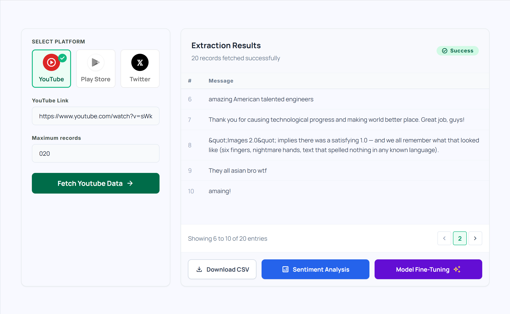
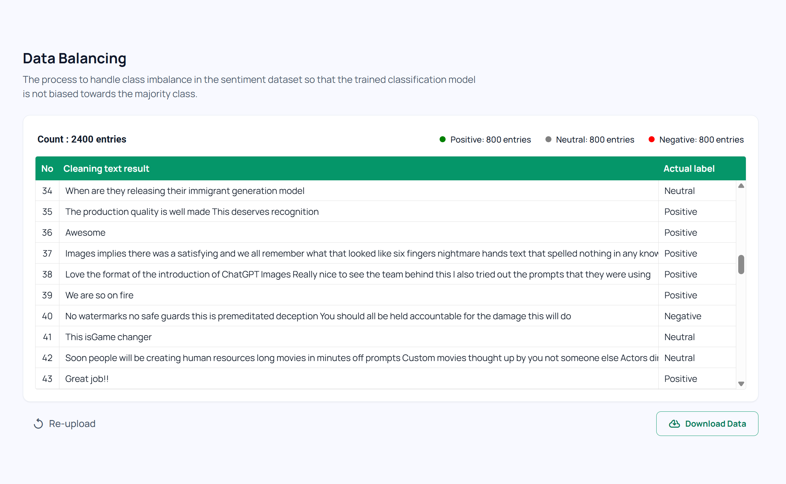
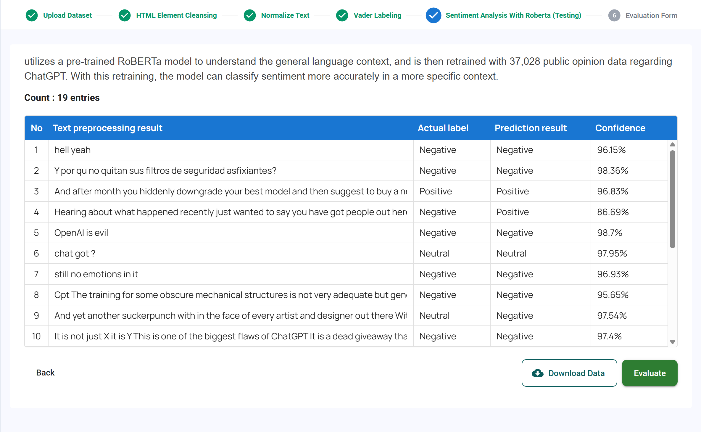
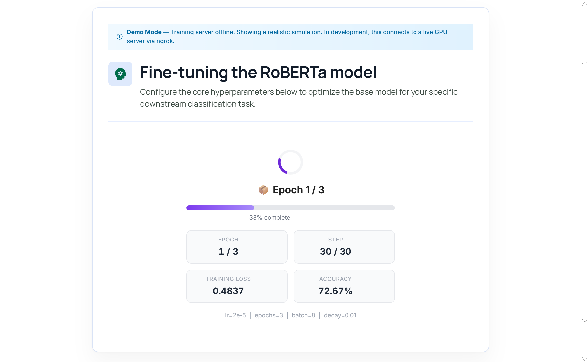

# SentimenAI 🧠

> An end-to-end platform for analyzing public sentiment from social media — powered by AI.

[](https://sentimenapp-frontend.vercel.app)
[](https://adrian766-sentimen-backend.hf.space/docs)
[](https://react.dev)
[](https://fastapi.tiangolo.com)

---

## 📌 Overview

**SentimenAI** is a full-stack sentiment analysis platform built as an undergraduate thesis project. It enables users to collect public opinions from social media platforms, preprocess raw text through an NLP pipeline, and classify sentiment using AI — all through an intuitive web interface with no coding required.

The platform was originally built to analyze public sentiment toward **ChatGPT** from Indonesian social media, using a **RoBERTa model fine-tuned on 37,000+ real user comments**.

---

## ✨ Key Features

| Feature | Description |
|---|---|
| 🌐 **Data Extraction** | Scrape real-time data from **YouTube**, **Google Play Store**, and **Twitter/X** by keyword |
| 🧹 **NLP Preprocessing** | 4-step pipeline: HTML cleansing → text normalization → sentiment labeling (VADER) → data balancing |
| 🤖 **AI Sentiment Analysis** | Classify text as Positive, Negative, or Neutral — supports single text and batch file upload |
| 🏗️ **Model Builder** | Interactive simulation of the RoBERTa fine-tuning pipeline (training, validation, evaluation) |
| 📊 **Data Visualization** | Highcharts-powered sentiment distribution, confusion matrix, and per-class metrics |
| 📁 **Export** | Download extracted and processed data as CSV or Excel |

---

## 🖥️ Live Demo

🔗 **[sentimenapp-frontend.vercel.app](https://sentimenapp-frontend.vercel.app)**

---

## 🏛️ Architecture

```
┌─────────────────────────────────────────────────────┐
│                    USER BROWSER                     │
│              React 19 + TypeScript                  │
│          (Vercel — Global CDN)                      │
└───────────────────────┬─────────────────────────────┘
                        │ REST API (Axios)
                        ▼
┌─────────────────────────────────────────────────────┐
│                   FASTAPI BACKEND                   │
│            Python 3.11 + Uvicorn                    │
│          (HuggingFace Spaces — Docker)              │
│                                                     │
│  ┌─────────────┐  ┌──────────────┐  ┌───────────┐  │
│  │  Scraping   │  │ NLP Pipeline │  │  Groq AI  │  │
│  │  Endpoints  │  │  (NLTK/VADER)│  │  Llama 3  │  │
│  └─────────────┘  └──────────────┘  └───────────┘  │
└─────────────────────────────────────────────────────┘
```

---

## 🛠️ Tech Stack

### Frontend
| Technology | Purpose |
|---|---|
| **React 19** + **TypeScript** | UI framework |
| **Tailwind CSS v3** | Utility-first styling |
| **Redux Toolkit** | Global state management |
| **React Router v7** | Client-side routing |
| **Highcharts** | Data visualization & charts |
| **Axios** | HTTP client |
| **PapaParse** | CSV parsing |
| **SheetJS (xlsx)** | Excel export |

### Backend
| Technology | Purpose |
|---|---|
| **FastAPI** | REST API framework |
| **Groq API** (Llama 3) | Sentiment classification in production |
| **VADER Sentiment** | Rule-based sentiment labeling for preprocessing |
| **NLTK** | NLP tokenization & stopword removal |
| **BeautifulSoup4** | HTML cleansing |
| **google-play-scraper** | Play Store review extraction |
| **Google YouTube Data API** | YouTube comment extraction |
| **Pandas** | Data manipulation |

### Infrastructure & Deployment
| Service | Purpose |
|---|---|
| **Vercel** | Frontend hosting (CI/CD via GitHub) |
| **HuggingFace Spaces** | Backend hosting (Docker container) |
| **GitHub** | Version control |

---

## 🔬 Research Context

This platform was developed as part of an undergraduate thesis on sentiment analysis using transfer learning. Key research decisions:

- **Model**: `cardiffnlp/twitter-roberta-base-sentiment` — fine-tuned on 37,000+ Twitter, YouTube, and Play Store comments about ChatGPT
- **Labeling Strategy**: VADER-based automatic labeling with manual validation
- **Class Balancing**: Oversampling with `nlpaug` to handle class imbalance
- **Production Tradeoff**: Fine-tuned RoBERTa used in research; Groq API (Llama 3) used in production due to GPU infrastructure cost constraints — a pragmatic engineering decision

---

## 🚀 Running Locally

### Prerequisites
- Node.js 18+
- Python 3.11+

### Frontend

```bash
# Clone the repository
git clone https://github.com/Adrian-Silalahi/sentimenapp_frontend.git
cd sentimenapp_frontend

# Install dependencies
npm install

# Create environment file
echo "REACT_APP_API_URL=https://adrian766-sentimen-backend.hf.space" > .env.local

# Start development server
npm start
```

The app will be available at `http://localhost:3000`

### Backend (Optional — for local API)

```bash
cd inference

# Create virtual environment
python -m venv venv
venv\Scripts\activate  # Windows

# Install dependencies
pip install -r requirements-prod.txt

# Set environment variables
echo "GROQ_API_KEY=your_groq_api_key" > .env

# Start server
uvicorn main:app --reload
```

---

## 📁 Project Structure

```
frontend/
├── public/
│   └── screenshots/        # App screenshots for landing page
├── src/
│   ├── api/                # Axios API call functions
│   ├── components/         # Reusable UI components
│   │   ├── layout/         # Sidebar & dashboard layout
│   │   ├── dataExtractionComponents/
│   │   ├── dataAnalyzeComponents/
│   │   └── modelSimulation/
│   ├── page/               # Route-level page components
│   │   ├── landing_page/
│   │   ├── dashboard/
│   │   ├── data_extraction/
│   │   ├── data_analyze/
│   │   └── robertaBuilder/
│   └── store/              # Redux store & slices
```

---

## 📸 Screenshots

### Data Extraction


### Preprocessing Pipeline


### Sentiment Analysis


### Model Builder Simulation


---

## 👤 Author

**Adrianus Silalahi**  
Undergraduate Thesis — Information Systems  
[](https://github.com/Adrian-Silalahi)

---

## 📄 License

This project is built for academic purposes. All rights reserved © 2025 Adrianus Silalahi.
